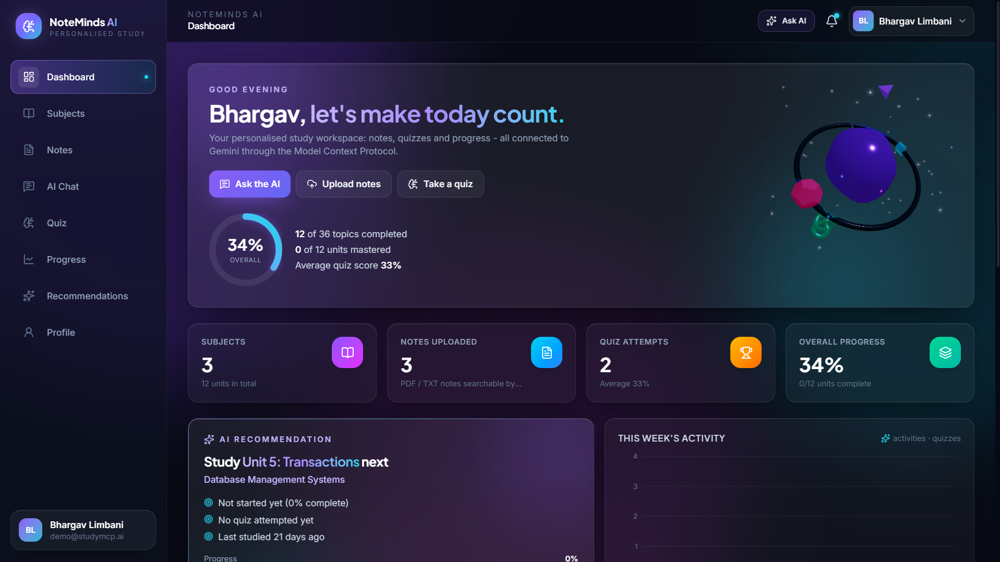
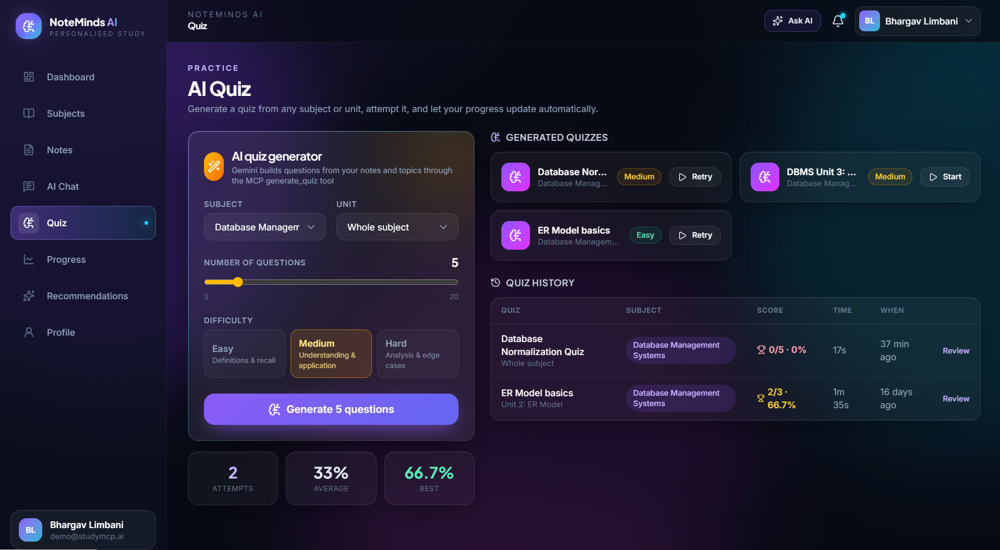
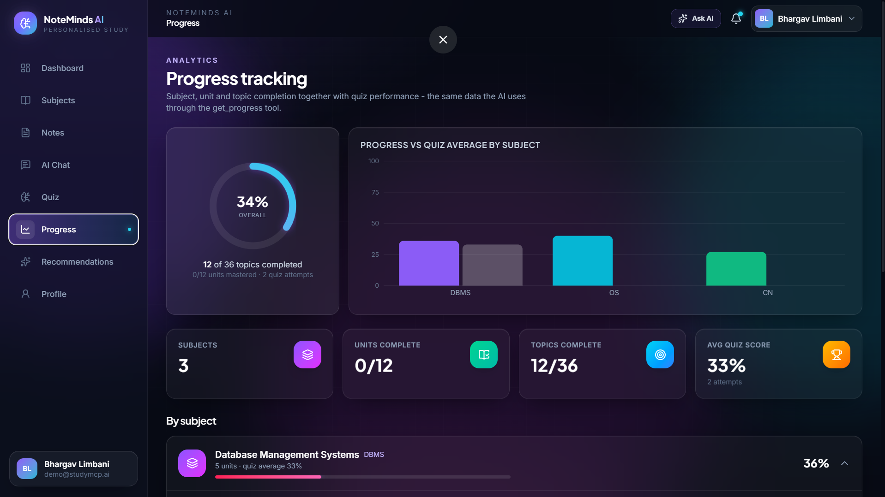
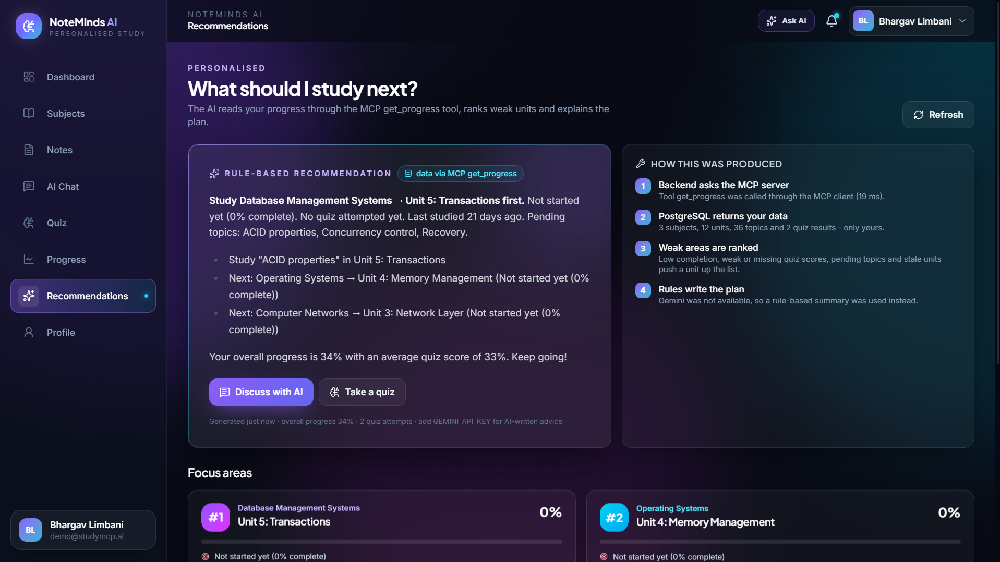

# NoteMinds AI

**A GenAI-powered personalised study assistant using the Model Context Protocol (MCP).**

NoteMinds AI is a full-stack web application for college students. Gemini answers questions from the student's *own* uploaded notes, generates quizzes, tracks progress and recommends what to study next. The AI never receives the database directly — every piece of student data reaches Gemini through **MCP tools** served by a real MCP server, scoped to the authenticated user.

> **One-line summary:** *NoteMinds AI is a personalised GenAI study assistant where Gemini uses MCP to securely access student-specific tools and data such as notes, subjects, quizzes and progress. It can answer questions from notes, generate quizzes, track performance and recommend what to study next.*

---

## Table of Contents

1. [Problem Statement](#1-problem-statement)
2. [Objectives](#2-objectives)
3. [Features](#3-features)
4. [Technology Stack](#4-technology-stack)
5. [Architecture](#5-architecture)
6. [What is MCP and How This Project Uses It](#6-what-is-mcp-and-how-this-project-uses-it)
7. [System Flow](#7-system-flow)
8. [Database Schema](#8-database-schema)
9. [Installation](#9-installation)
10. [Environment Variables](#10-environment-variables)
11. [Running Locally](#11-running-locally)
12. [API Reference](#12-api-reference)
13. [Testing](#13-testing)
14. [Deployment (Render + Supabase)](#14-deployment-render--supabase)
15. [Demo Script](#15-demo-script)
16. [Screenshots](#16-screenshots)
17. [Future Scope](#17-future-scope)

---

## 1. Problem Statement

Generic chatbots answer from general knowledge. They do not know a student's syllabus, their uploaded notes, which units they have finished or how they scored in quizzes. Students therefore receive generic explanations and no guidance on *what to study next*.

---

## 2. Objectives

- Let a student organise subjects → units → topics and upload PDF/TXT notes.
- Answer questions **from the student's own notes** using Gemini.
- Generate quizzes from the notes, grade them and store results.
- Track progress at subject, unit and topic level.
- Recommend the next topic to study based on progress and quiz performance.
- Demonstrate a real **MCP client ↔ MCP server** integration where the AI decides when to call tools.
- Keep every student's data private (strict ownership checks on every query).

---

## 3. Features

| Area | Details |
| --- | --- |
| Authentication | Register, login, logout, JWT, bcrypt password hashing, protected routes, `/auth/me` |
| Subjects & units | CRUD for subjects, units and topics; topic checklist drives unit progress automatically |
| Notes | PDF/TXT upload (validated), text extraction (`pdf-parse`), chunking, PostgreSQL full-text search |
| AI chat | ChatGPT-style UI, Markdown + code rendering, history, delete conversations, MCP tool badges and a "how it worked" flow panel |
| MCP | Real MCP server (official TypeScript SDK) with 6 tools; MCP client used by the Gemini agent, quiz API and recommendations |
| Quiz | Subject/unit, 3–20 questions, easy/medium/hard, MCQ + true/false, timer, grading with explanations, history |
| Progress | Progress rings/bars, charts, per-unit topic and quiz stats |
| Recommendations | Rule-based ranking of weak units + Gemini-written study plan |
| Dashboard | Statistics, subject progress, recommended next topic, recent quizzes, recent chats, weekly activity chart |
| UI | React + Tailwind v4, glassmorphism, 3D tilt cards, Three.js hero scene, animations, responsive (mobile + desktop) |
| Security | Helmet, CORS allow-list, rate limiting, zod validation, structured errors, no stack traces in production |

---

## 4. Technology Stack

| Layer | Technology |
| --- | --- |
| Frontend | React 19, Vite 8, TypeScript, Tailwind CSS 4, React Router 7, Framer Motion, Three.js (react-three-fiber + drei), Recharts, react-markdown |
| Backend | Node.js 20+, Express 5, TypeScript (ESM), zod, multer, pdf-parse |
| AI | Google Gemini via `@google/genai` (function calling + JSON schema output) |
| MCP | `@modelcontextprotocol/sdk` — `McpServer` (stdio + in-memory transports) and `Client` |
| Database | PostgreSQL, Prisma ORM (migrations + seed) |
| Storage | PostgreSQL for extracted text; optional Supabase Storage for original files |
| Testing | Vitest + Supertest |
| Deployment | Render (web service + static site), Supabase PostgreSQL |

---

## 5. Architecture

```
┌──────────────┐   HTTPS/JSON   ┌──────────────────────────────────────────────────────────┐
│ React + Vite │ ─────────────▶ │ Express API (JWT auth, validation, controllers/services)  │
│  frontend    │ ◀───────────── │                                                          │
└──────────────┘                │  ┌───────────────┐   tools/list, tools/call              │
                                │  │ Gemini agent  │ ─────────────┐                        │
                                │  │ (ai/agent.ts) │              ▼                        │
                                │  └──────┬────────┘      ┌───────────────┐                │
                                │         │ fn calls      │  MCP client   │                │
                                │         ▼               │ (mcp/client)  │                │
                                │  ┌───────────────┐      └──────┬────────┘                │
                                │  │  Gemini API   │             │ JSON-RPC (stdio)         │
                                │  └───────────────┘             ▼                         │
                                │                        ┌───────────────┐                 │
                                │                        │  MCP server   │  separate        │
                                │                        │ (mcp/server)  │  process         │
                                │                        └──────┬────────┘                 │
                                │                               │ MCP tools                 │
                                │                               ▼                           │
                                │   search_notes · get_subjects · get_topics                │
                                │   get_progress · save_progress · generate_quiz            │
                                └───────────────────────────────┬──────────────────────────┘
                                                                ▼
                                                ┌──────────────────────────┐
                                                │  PostgreSQL (Prisma ORM) │
                                                └──────────────────────────┘
```

**Backend folder layout:**

```
backend/src
├── ai/           gemini.ts (SDK wrapper), agent.ts (tool-calling loop), prompts.ts, schema.ts
├── mcp/
│   ├── server/   createServer.ts (McpServer factory), server.ts (stdio entry point)
│   ├── client/   client.ts (MCP client: stdio or in-memory transport)
│   └── tools/    notes.tool.ts, subjects.tool.ts, topics.tool.ts, progress.tool.ts, quiz.tool.ts
├── controllers/  thin HTTP handlers
├── services/     business logic (auth, subjects, units, topics, notes, quiz, chat, progress, dashboard)
├── routes/       express routers + zod schemas
├── middleware/   auth, validation, rate limiting, upload, error handler
├── config/       env, prisma, logger
└── utils/        AppError, jwt, password, pdf, text helpers
```

---

## 6. What is MCP and How This Project Uses It

The **Model Context Protocol** is an open protocol that standardises how an AI model gets access to external tools and data. An **MCP server** publishes tools (name, description, JSON-schema input) and an **MCP client** discovers them (`tools/list`) and executes them (`tools/call`) over JSON-RPC.

In NoteMinds AI:

- `backend/src/mcp/server/` builds an `McpServer` with the official TypeScript SDK and registers six tools (each validated with zod). It runs as a **separate process over stdio** (default) or in-memory.
- `backend/src/mcp/client/client.ts` connects to it, caches `tools/list` and exposes `callTool()`.
- `backend/src/ai/agent.ts` converts the MCP tool list into Gemini *function declarations* — **removing the `userId` parameter so the model can never choose whose data to read** — and runs the loop: Gemini → function call → MCP client → MCP server → tool → PostgreSQL → result → Gemini.
- REST endpoints also use MCP: `POST /api/quizzes/generate` calls the `generate_quiz` tool and `GET /api/recommendations` fetches progress with `get_progress`.

| Tool | Purpose | Input (besides `userId`) |
| --- | --- | --- |
| `search_notes` | Full-text search over the student's note chunks | `query`, `subjectId?`, `unitId?`, `limit?` |
| `get_subjects` | List subjects with unit/note counts and progress | — |
| `get_topics` | Units + topics + completion for a subject | `subjectId` or `subjectName` |
| `get_progress` | Subject/unit progress, completed/pending topics, quiz stats | `subjectId?` |
| `save_progress` | Mark topic done or set unit completion % | `topicId?`, `unitId?`, `completion?` |
| `generate_quiz` | Build a quiz from notes + topics with Gemini and save it | `subjectId`, `unitId?`, `numberOfQuestions?`, `difficulty?` |

**Development log — full flow for every chat message:**

```
[ai-agent] AI request {"message":"Explain 3NF from my notes.","availableTools":[...]}
[ai-agent] MCP tool selected -> search_notes {"input":{"query":"3NF OR Third Normal Form"}}
[mcp-tool] -> search_notes ... <- search_notes (12ms)
[ai-agent] MCP tool result <- search_notes {"ok":true,"durationMs":123,...}
[ai-agent] AI final response {"toolsUsed":["search_notes"],...}
```

---

## 7. System Flow

**Chat:** login → `POST /api/chat` → history loaded → Gemini receives tool declarations → Gemini returns a function call → backend injects the authenticated `userId` → MCP client → MCP server → tool → PostgreSQL → result back to Gemini → final Markdown answer → both messages (with tool metadata) stored → frontend shows the answer plus "MCP · search_notes" badges.

**Quiz:** Quiz page → `POST /api/quizzes/generate` → MCP `generate_quiz` → notes + topics gathered → Gemini JSON-schema response → validated → saved → student attempts → `POST /api/quizzes/:id/submit` → graded → `QuizResult` saved → unit progress raised to at least the score → recommendations updated.

**Recommendation:** `GET /api/recommendations` → MCP `get_progress` → rule-based ranking (low completion, weak/missing quiz scores, pending topics, not studied recently) → Gemini writes a short plan.

---

## 8. Database Schema

```
User ──< Subject ──< Unit ──< Topic
 │          │         │
 │          │         ├──< Progress  (unique per user + unit)
 │          │         └──< Note ──< NoteChunk
 │          └──< Quiz ──< QuizQuestion
 │                 └──< QuizResult
 ├──< Conversation ──< Message  (toolCalls JSON)
 └──< Activity
```

Full definitions with indexes and cascade rules: `backend/prisma/schema.prisma`.

---

## 9. Installation

**Prerequisites:** Node.js 20+, PostgreSQL 14+ (or a Supabase project), a Gemini API key from <https://aistudio.google.com/>.

```bash
git clone <your-repo-url> noteminds-ai
cd noteminds-ai
npm run install:all            # installs backend and frontend dependencies
cp .env.example backend/.env   # then edit values
cp frontend/.env.example frontend/.env
```

---

## 10. Environment Variables

### `backend/.env`

| Variable | Description |
| --- | --- |
| `DATABASE_URL` | PostgreSQL connection string. URL-encode special characters in the password (`@` → `%40`). |
| `JWT_SECRET` | Long random string used to sign tokens |
| `JWT_EXPIRES_IN` | Token lifetime, default `7d` |
| `GEMINI_API_KEY` | Google Gemini API key (AI features are disabled without it) |
| `GEMINI_MODEL` | Default `gemini-2.5-flash` |
| `PORT` | API port, default `5000` |
| `NODE_ENV` | `development` / `production` |
| `FRONTEND_URL` | Comma-separated allowed origins for CORS |
| `MCP_TRANSPORT` | `stdio` (separate MCP server process, default) or `inmemory` |
| `SUPABASE_URL`, `SUPABASE_SERVICE_ROLE_KEY`, `SUPABASE_STORAGE_BUCKET` | Optional persistent storage for original uploaded files |
| `MAX_UPLOAD_MB` | Upload limit, default `10` |

### `frontend/.env`

| Variable | Description |
| --- | --- |
| `VITE_API_URL` | Backend base URL, e.g. `http://localhost:5000/api` |

> **Note:** Never commit `.env` files (they are gitignored).

---

## 11. Running Locally

```bash
# 1. Database
cd backend
npx prisma migrate dev          # creates the database schema
npm run prisma:seed             # demo user: demo@noteminds.ai / demo1234

# 2. Backend  (terminal 1)
npm run dev                     # http://localhost:5000

# 3. Frontend  (terminal 2)
cd ../frontend
npm run dev                     # http://localhost:5173
```

**Useful backend scripts:**

| Script | What it does |
| --- | --- |
| `npm run mcp:server` | Run the MCP server alone on stdio |
| `npm run mcp:inspect` | Open the MCP Inspector to try each tool manually |
| `npm run mcp:test -- <email>` | Connect to the MCP server over stdio and call every tool |
| `npm run prisma:studio` | Browse the database visually |
| `npm run build && npm start` | Production build (`dist/`) and start |

---

## 12. API Reference

All responses use `{ success, data, message? }`; errors use `{ success: false, message, details? }`.  
Protected routes require `Authorization: Bearer <token>`.

| Method | Route | Description |
| --- | --- | --- |
| POST | `/api/auth/register`, `/api/auth/login`, `/api/auth/logout` | Authentication |
| GET / PUT | `/api/auth/me`, `/api/auth/me/password` | Current user, profile, password |
| GET / POST | `/api/subjects` | List / create subjects |
| GET / PUT / DELETE | `/api/subjects/:id` | Subject detail / update / delete |
| GET / POST | `/api/subjects/:id/units` | Units of a subject / create unit |
| PUT / DELETE | `/api/units/:id` | Update / delete unit |
| POST | `/api/units/:id/topics` | Add topic |
| PATCH / DELETE | `/api/topics/:id` | Mark topic complete / delete |
| POST | `/api/notes/upload` | Upload + extract + chunk (multipart: `file`, `subjectId`, `unitId?`, `title?`) |
| GET | `/api/notes`, `/api/notes/:id`, `/api/notes/search?q=` | List, detail, search |
| DELETE | `/api/notes/:id` | Delete note |
| POST | `/api/chat` `{ message, conversationId? }` | Gemini + MCP agent |
| GET / DELETE | `/api/conversations`, `/api/conversations/:id` | Chat history |
| POST | `/api/quizzes/generate` | Generate quiz via MCP `generate_quiz` |
| GET | `/api/quizzes`, `/api/quizzes/:id`, `/api/quizzes/history`, `/api/quizzes/results/:id` | Quizzes and results |
| POST | `/api/quizzes/:id/submit` | Grade an attempt |
| GET / PUT | `/api/progress` | Progress overview / update |
| GET | `/api/recommendations?ai=1` | Personalised recommendation |
| GET | `/api/dashboard` | Dashboard aggregate |
| GET | `/api/health`, `/api/mcp/status` | Health and MCP/AI status |

---

## 13. Testing

```bash
cd backend
npm test
```

- **`tests/api.test.ts`** — registration, login, protected routes, subject/unit/topic creation, progress updates, TXT upload + search, invalid file handling, cross-user data isolation, and the dashboard.
- **`tests/mcp-tools.test.ts`** — starts a real MCP server + client (in-memory transport) and tests every tool, including the MCP → Gemini function-declaration conversion and ownership checks.

Both suites run against the database in `DATABASE_URL` and clean up their own test users.

Manual end-to-end: `npm run mcp:test` (stdio tools), the Notes page search box, and the "How it worked" panel under any AI answer.

---

## 14. Deployment (Render + Supabase)

1. **Database** – create a Supabase project, copy the *connection pooling* URL into `DATABASE_URL`.
2. **Backend** – Render Web Service, root `backend`:
   - Build: `npm ci && npx prisma generate && npm run build && npx prisma migrate deploy`
   - Start: `npm start`
   - Health check: `/api/health`
   - Set all env vars from section 10 (`FRONTEND_URL` = static site URL).
3. **Frontend** – Render Static Site, root `frontend`:
   - Build: `npm ci && npm run build`
   - Publish: `dist`
   - Rewrite: `/*` → `/index.html`
   - Env: `VITE_API_URL=https://<backend>.onrender.com/api`
4. **Files** – extracted text lives in PostgreSQL; nothing depends on Render's ephemeral disk. For original PDFs, create a Supabase Storage bucket and set the `SUPABASE_*` variables.

A ready-to-use blueprint is in `render.yaml`.

---

## 15. Demo Script

1. Login as `demo@noteminds.ai / demo1234` (or register a new account).
2. **Subjects** → *New subject* → **DBMS**.
3. Open DBMS → *Add unit* → **Unit 3: Normalization** with topics (1NF, 2NF, 3NF, BCNF).
4. **Notes** → upload the DBMS Unit 3 PDF for that unit (a TXT works too).
5. **AI Chat** → *"Explain 3NF from my notes."* → answer cites the note; badge shows `MCP · search_notes`; expand *How it worked* to see the full Gemini → MCP client → MCP server → tool → PostgreSQL → Gemini flow.
6. Chat → *"Generate 5 MCQs from this unit."* → quiz is created through `generate_quiz`.
7. **Quiz** page → attempt it → score, explanations, unit progress updated.
8. Chat → *"What should I study next?"* → `get_progress` → personalised recommendation.
9. **Dashboard** shows statistics, progress, recent quiz and chat; **Profile** shows the live MCP status and registered tools.

### Troubleshooting

| Symptom | Fix |
| --- | --- |
| `AI features are not configured` | Add `GEMINI_API_KEY` to `backend/.env` and restart the backend. |
| `The AI service is busy (quota exceeded)` | Wait a minute, or switch to `GEMINI_MODEL=gemini-2.5-flash-lite` (higher free-tier limits). |
| `Could not connect to PostgreSQL` | Check `DATABASE_URL`; URL-encode special chars in the password (`@` → `%40`). |
| MCP not connected on Profile page | MCP server spawns as a child process. Set `MCP_TRANSPORT=inmemory` if child processes are blocked on your host. |
| Scanned PDF gives "No readable text" | Only text-based PDFs are supported; export notes as a text-layer PDF. |
| Backend not starting under an IDE runner | Use `npm run dev:preview` (no file watcher) if `tsx watch` fails under the runner. |

---

## 16. Screenshots

### Login Page


### Dashboard


### AI Chat with MCP Badges


### Notes Upload


### Quiz


### Progress


### Recommendations


---

## 17. Future Scope

- AI study planner (exam date + available hours → day-by-day plan) as an extra MCP tool.
- OCR for scanned PDFs and support for DOCX/PPTX notes.
- Semantic (embedding-based) search over note chunks with `pgvector`.
- Spaced-repetition flashcards generated from notes.
- Streaming chat responses and voice input.
- Teacher/classroom mode with shared subjects.